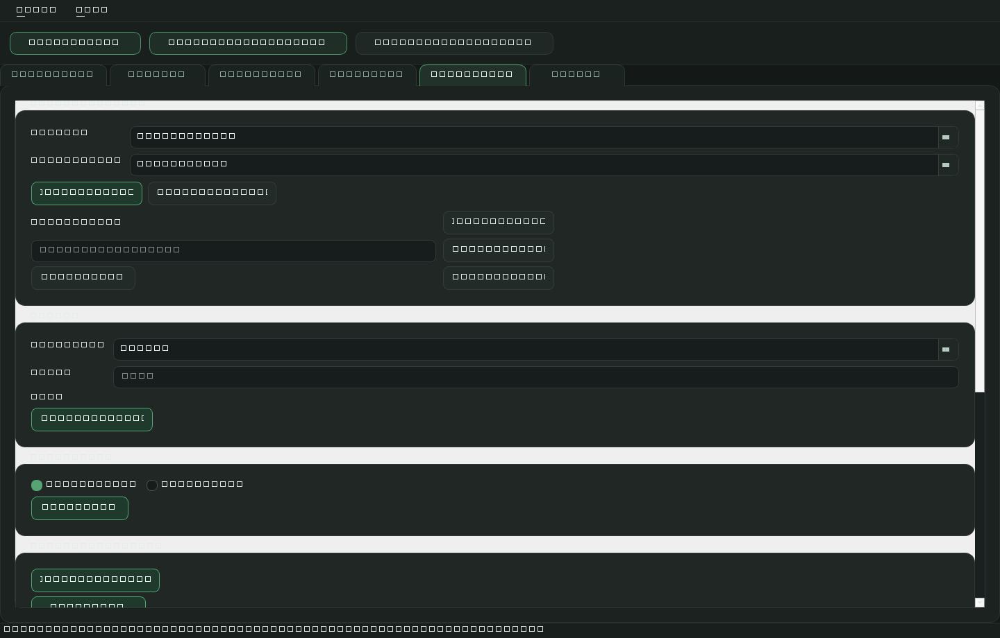

# MinAn V1

[](LICENSE)
[](https://www.python.org/downloads/)
[](https://github.com/mickhornung-oss/minan-csv-analyse/actions/workflows/python-tests.yml)

Stable release (`v1.4.0`) of a production-ready Windows desktop mini-tool for fast CSV analysis.

## Product Overview

MinAn loads CSV files, analyzes structure and data quality, and lets users filter/edit an active view before exporting CSV or HTML reports. The source CSV is never overwritten.

Target users: analysts, QA teams, and developers who need fast local CSV sanity checks without cloud dependencies.



## Status and Scope

- Product line: `MinAn 1.4`
- Release identity: `v1.4.0`
- Scope: local/offline desktop usage (Windows)
- Delivery model: portable one-folder build (`dist/MinAn_1_4/`)
- Public hosted demo: not provided
- Reference test run (2026-04-17): `155 passed` via `pytest -q`

## Core Features

- CSV import with automatic encoding and separator detection
- Dataset overview with profile, quality findings, and summary
- Active-view workflow with filters and quick views (missing values, duplicates, outlier candidates)
- Tab-based desktop UI (Overview, Table, Metrics, Charts, Edit, Export)
- CSV export of the active view
- HTML report export of the active view
- Bundled sample dataset for quick local evaluation

## Tech Stack

- Python 3.10+
- PySide6 (desktop UI)
- pandas + numpy (data processing)
- matplotlib (charts/report snapshots)
- pytest (automated tests)
- PyInstaller (portable packaging)

## Quickstart

### End user (portable build)

1. Build a release (or use an already built one):
   `build_release.bat`
2. Run:
   `dist\\MinAn_1_4\\MinAn.exe`

### Developer mode

1. Install dependencies:
   `pip install -r requirements.txt`
2. Start app:
   `run_dev.bat`

## Testing and Quality Gates

Baseline local gates (compile + tests):

`python scripts/quality_gates.py`

Full local gates (compile + tests + release build + EXE smoke):

`python scripts/quality_gates.py --with-build --with-exe-smoke`

## Packaging and Build

Build command:

`build_release.bat`

Build source of truth:

- PyInstaller spec: `packaging/pyinstaller/minan_v1.spec`
- Windows version metadata: `packaging/pyinstaller/windows_version_info.txt`
- Bundled release sample: `_internal/sample_data/test_csv_deutsch_200x15.csv`

Generated artifacts are intentionally not versioned (`build/`, `dist/`, `output/`).

## Documentation

Primary docs index: [`docs/README.md`](docs/README.md)

- Release notes: [`docs/release.md`](docs/release.md)
- Change history: [`CHANGELOG.md`](CHANGELOG.md)
- Project status: [`docs/status.md`](docs/status.md)

## Repository Structure

```text
.
|- src/minan_v1/              # app core (domain/services/ui/utils)
|- tests/                     # automated tests
|- assets/                    # icons, sample CSV, screenshots
|- packaging/pyinstaller/     # versioned build/packaging sources
|- docs/                      # public + internal documentation
|- scripts/                   # product-check helper scripts
|- run_dev.bat                # local developer start
|- build_release.bat          # release build entrypoint
`- requirements.txt
```

## Known Limitations

- Windows-first desktop target (no cross-platform packaging support documented yet)
- No hosted/web demo; evaluation is local only
- CI remains intentionally minimal (Windows quality gates on push/PR, packaging smoke on manual dispatch)
- No automated GitHub artifact publishing pipeline is defined yet

## License

Licensed under the MIT License. See [`LICENSE`](LICENSE).
